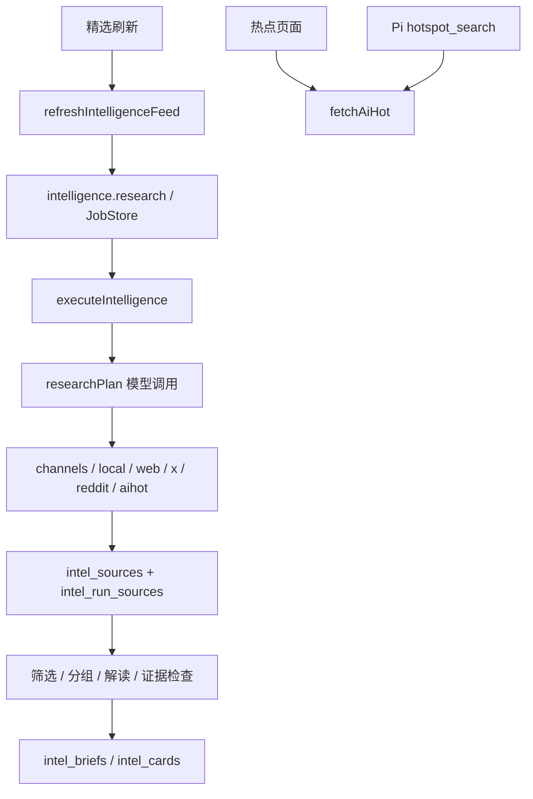

# 情报采集 V3：P0 实际盘点

核查日期：2026-09-20。当前分支 `experiment/content-bridge`，基线 `b6f597b7508ae3f17f6362fd4caf24f1250a439d`。执行包作为设计输入保存于 `docs/acquisition-v3-input/`，两份清单原样保存于 `workbench/config/acquisition-v3/`；其中的 enabled、验证状态不是部署事实。

## 数据库与恢复边界

只读打开运行时路径解析器所指向的 `D:\文档\Xenho\Workspace\workspace.sqlite`：user_version=28，integrity_check=ok。项目说明中的 workbench.db 与实际文件名不一致；本次沿用实际 workspace.sqlite，不改名。未迁移或写入用户数据库。

| 表 | 实际记录数 |
| --- | ---: |
| local_jobs / local_job_runs / local_schedules | 1675 / 1712 / 2 |
| intel_profiles / intel_runs / intel_steps | 2 / 7 / 48 |
| intel_sources / intel_run_sources | 190 / 199 |
| intel_cards / intel_briefs / intel_brief_versions | 5 / 20 / 21 |
| intel_channels / intel_clusters / intel_cluster_members | 28 / 6 / 17 |

现有 JobStore 有幂等键、领取事务、租约代次、心跳、过期回收、三次重试与运行历史，可直接扩展。缺少按任务类型领取、可取消网络请求、按 Retry-After 持久退避。下一迁移为 0029，先在临时工作区做备份及恢复校验和迁移故障测试。

## 真实调用链

关键源码：`server/domain/intelligence{,-runner,-feed,-editor,-channels,-quality}.mjs`、`server/jobs/{job-store,local-job-runner,workspace-runtime,startup-scheduler,default-job-handlers}.mjs`、`server/routes/hot.mjs`、`server/agent-runtime/pi-tools.mjs`。

1. 旧 runner 在任何采集之前调用模型，模型故障会挡住原始资料入库。V3 独立采集任务必须先入库，后续解读只消费已采集资料。
2. AIHOT 存在 runner、热点页面、Pi 工具三条现役联网路径，另有历史 radar 日报脚本。现役调用 `/api/v1/hot-topics`、`/api/v1/items`、`/api/v1/stories/:id`；未发现 `/api/public` 字面调用。需要统一读本地采集缓存，不能并行重复抓取。
3. channels 已有 RSS/Atom/GitHub release 解析、Readability 正文提取与公开 URL 检查，可复用。来源 fingerprint 仍包含 provider，因此 V3 要增加逻辑身份和多渠道发现关系，保持旧 ID 与引用。
4. x/reddit 默认是站点限定搜索；批准后为 Bright Data dataset，不是 Reddit 官方 OAuth 评论树。V3 不走这些收费或匿名回退路径。
5. profiles 已有 daily/weekly 调度，briefs 则限制 manual。不是全系统没有定时任务。后台默认另有两个 local_schedules。

## Skill 与旧模块

现役 `.agents/skills/intelligence-research/SKILL.md` 由 assistant-runner / Pi additionalSkillPaths 注册；属于按需分析与补查，不注册定时采集。应改成优先读取已采集资料。

`workbench/skills/personal-intelligence-radar` 已标历史，但其 Bright Data helper 与 sources.json 仍被旧代码 import。不可整目录删除。其 fetch-material --go 输出临时 JSON / vault Markdown，不是 SQLite 真源，V3 不调用。历史日报脚本吞掉所有错误，不复用其成功判定。douyin-data 是后台导出旧 Skill，本次不扩展。

## 实际外部合同

AIHOT OpenAPI 实际读取成功（2026-09-20 UTC），快照有分页 nextPage 和固定水位 cursor，changes 有 upsert/remove，409 需要重建。hot items 的 id 不是 story publicId；只能从返回的 links.story 取得 story 路径 ID。日报保存整份 report。

Follow Builders 固定提交 `e062f01a3dd8a32505169a5b9765707f5895a6e1` 四文件实际 HTTP 200：X 有 13 个作者组；播客 1 期、逐字稿 39751 字符；blogs 合法空数组；state 没有 generatedAt。三个 feed 时间不必一致，state 的 seen 集合不得替代本地导入记录。

完整逐源证据由 `source-validation.json` 和 `acquisition-source-validation.md` 记录，失败入口和全部原始行保留。发现公开 192.0.66/78 地址被旧安全函数误判，需精确修复网段，不能绕过安全检查。The Verge 原拟 AI RSS 返回 404，全站 RSS 仅为候选，不能冒充专栏验证成功。

只检查密钥名称：未发现 Reddit OAuth / GitHub token；存在旧 Bright Data 配置但 V3 不使用。Reddit 所有入口在获准访问和凭据前保持 blocked；模拟评论测试不代表真实接入。

## 阶段实施映射

- P1：扩展现有 intel_channels + JobStore，新增运行、检查点、快照、发现、版本、指标与段落；网络在事务外，提交须校验租约。
- P2–P4：适配器只产生标准化页与建议检查点，统一 runner 写入；保留全文/摘要、上游状态、历史缺口、评论结构及权限。
- P5：现有信源、资料、处理记录页面增量扩展；旧精选改读本地资料，保留显式研究补查。
- P6：隔离故障测试、真实少量只读烟测、浏览器操作分别报告；7 天观察待实际部署后记录，不提前宣称通过。
